<a id="readme-top"></a>

<!-- PROJECT LOGO -->
<br />
<div align="center">
  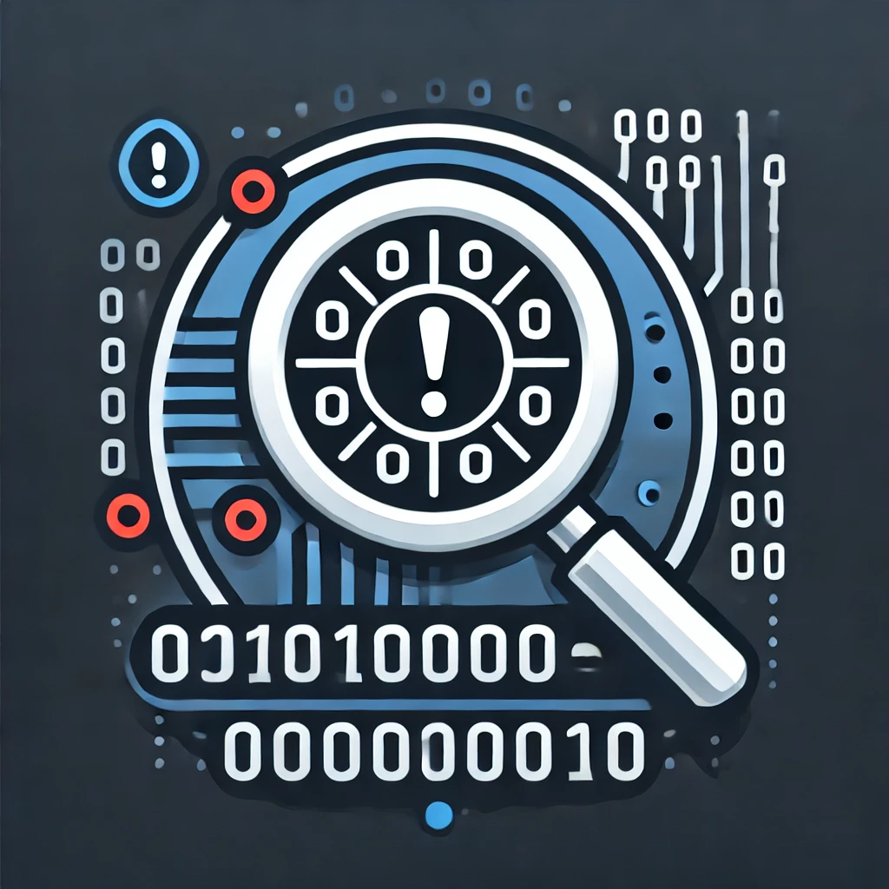

  <h3 align="center">Codetective</h3>

  <p align="center">
    This application leverages AI to analyze C/C++ code within public or private repositories on platforms like GitHub, GitLab, Gitea, and Bitbucket. It identifies potentially vulnerable functions by referencing functions from previous CVEs. The tool automates the detection process to enhance code security across various repository platforms.
  </p>
</div>

<!-- TABLE OF CONTENTS -->
<details>
  <summary>Table of Contents</summary>
  <ol>
    <li>
      <a href="#about-the-project">About The Project</a>
      <ul>
        <li><a href="#preview">Preview</a></li>
        <li><a href="#built-with">Built With</a></li>
      </ul>
    </li>
    <li>
      <a href="#getting-started">Getting Started</a>
      <ul>
        <li><a href="#prerequisites">Prerequisites</a></li>
        <li><a href="#environment-variables">Environment Variables</a></li>
        <li><a href="#setup">Setup</a></li>
        <li><a href="#start">Start</a></li>
        <li><a href="#stop">Stop</a></li>
      </ul>
    </li>
  </ol>
</details>

<!-- ABOUT THE PROJECT -->

## About The Project

### Preview

https://github.com/user-attachments/assets/cc69ad71-5252-48be-9a75-6aa0f09e5532

<details>
  <summary style="font-weight: bolder;">Screenshots</summary>
  <div align="center">
    <div>
      <h2 align="center">Landing Page</h2>
      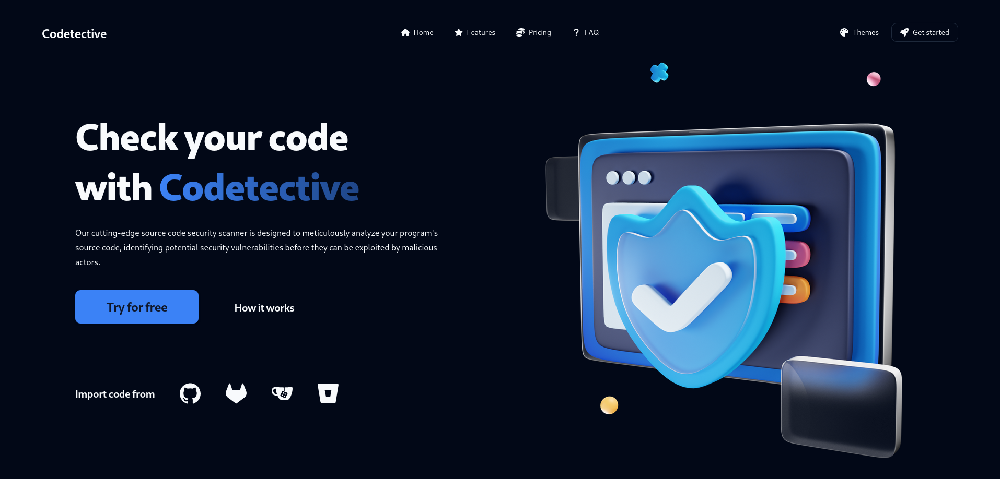
      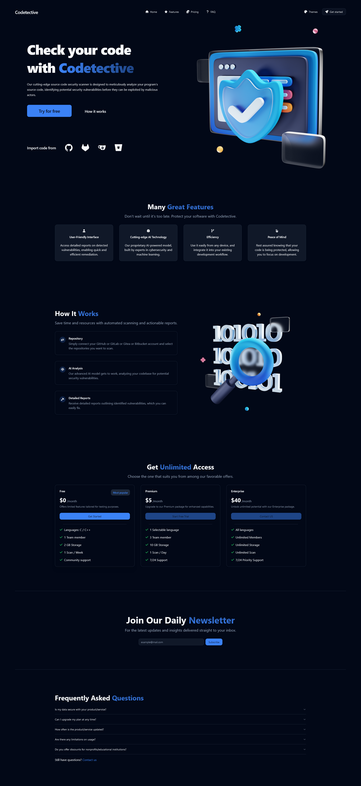
    </div>
    <div>
      <h2 align="center">Register Page</h2>
      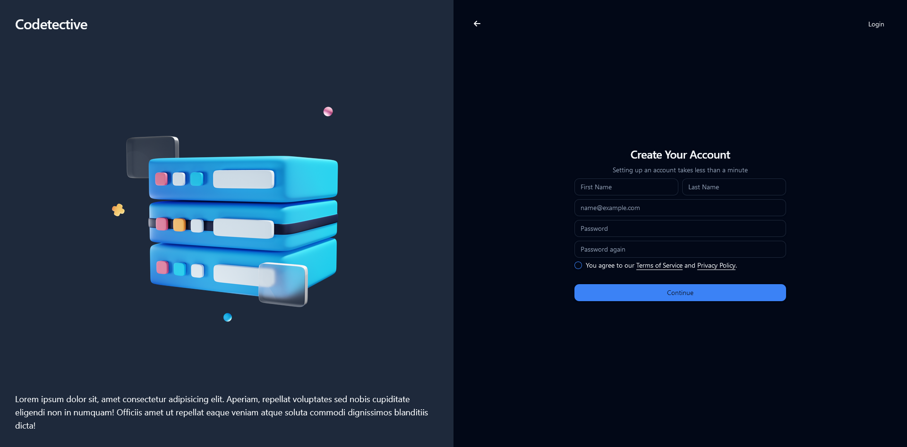
    </div>
    <div>
      <h2 align="center">Login Page</h2>
      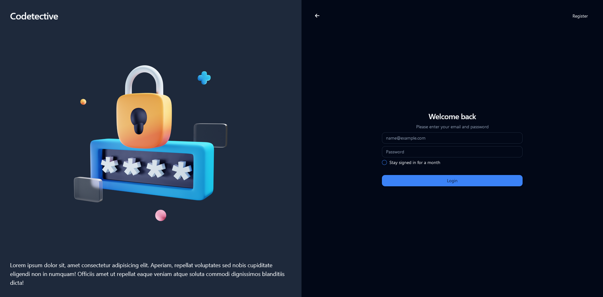
    </div>
    <div>
      <h2 align="center">Home Page</h2>
      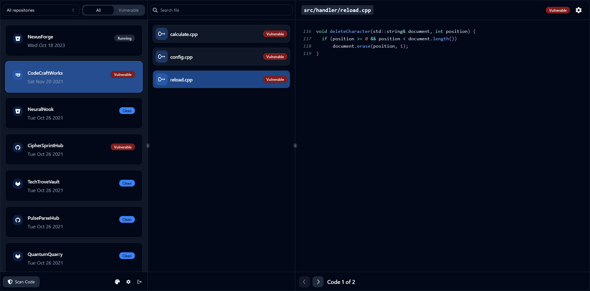
      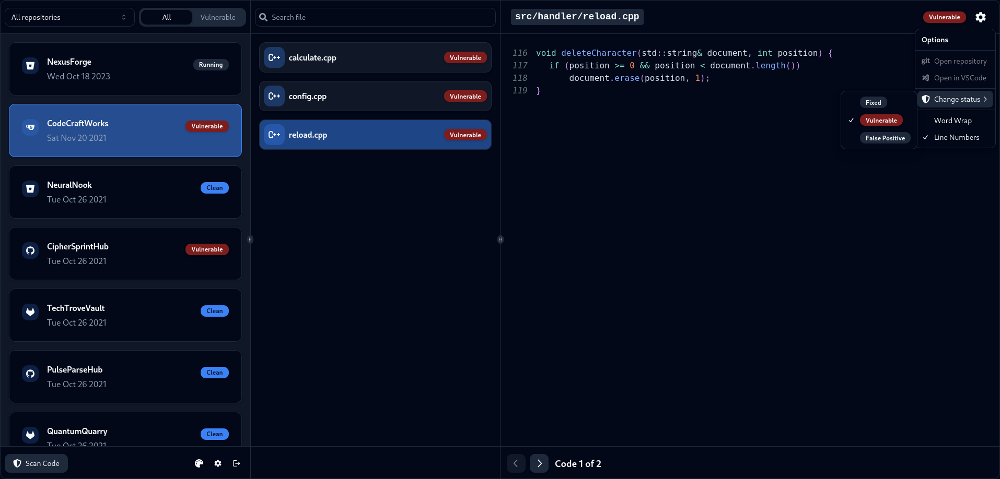
      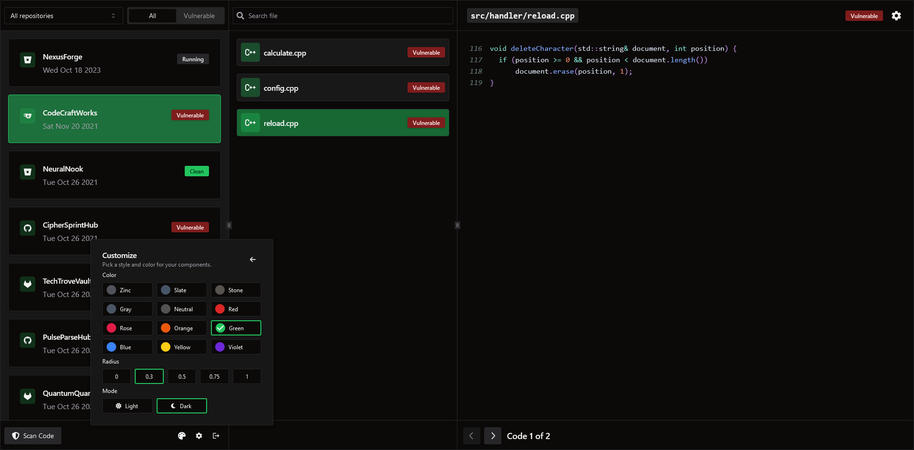
      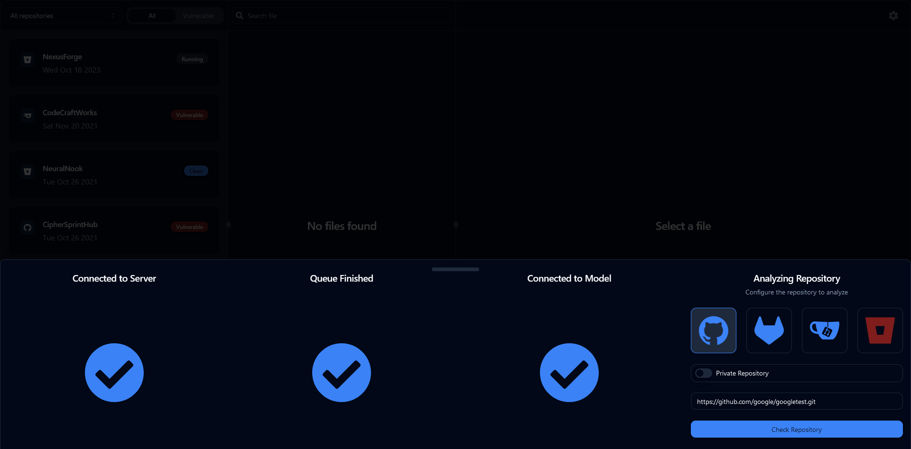
      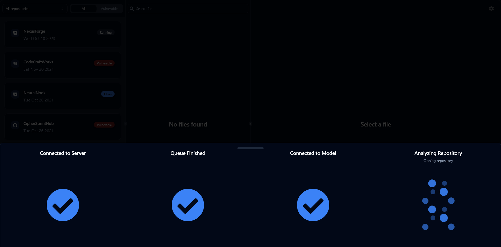
    </div>
    <div>
      <h2 align="center">Settings Page</h2>
      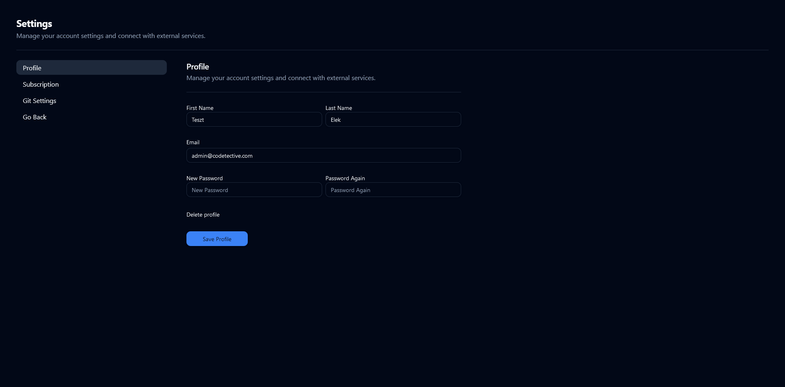
      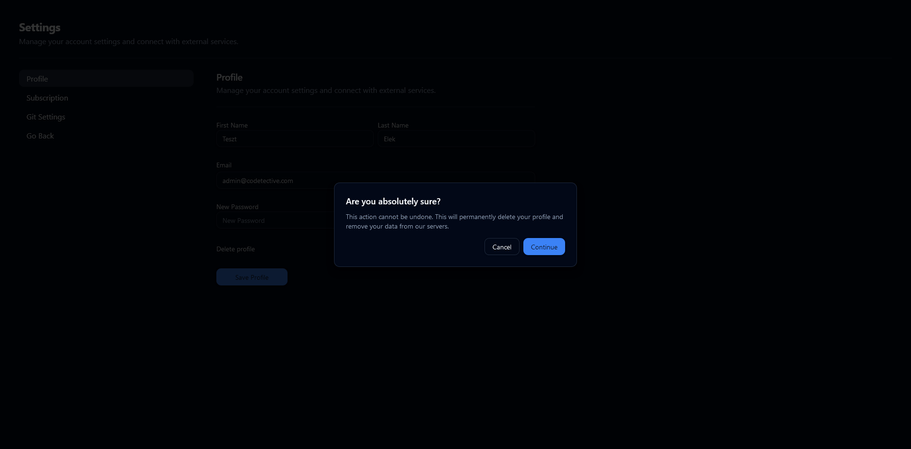
      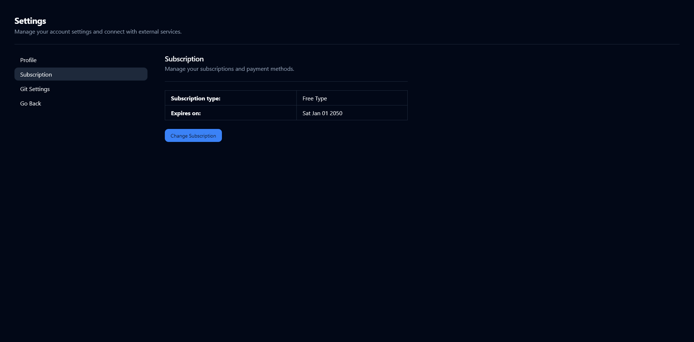
      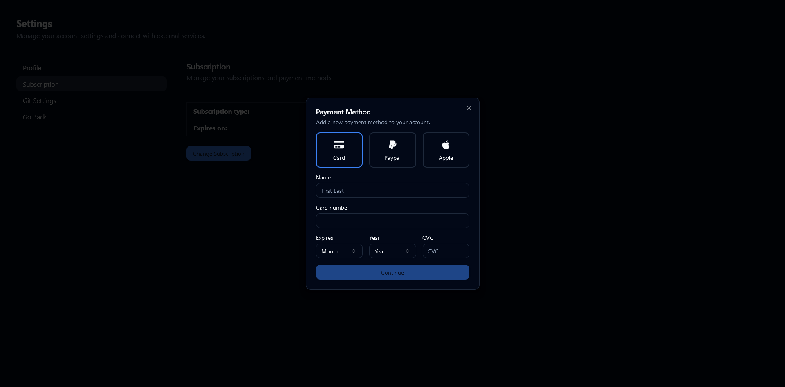
      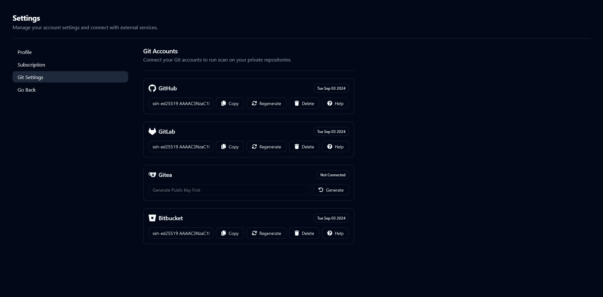
    </div>
  </div>
</details>

<p align="right">(<a href="#readme-top">back to top</a>)</p>

### Built With
[![React][React-badge]][React-url]
[![Bun][Bun-badge]][Bun-url]
[![Golang][Golang-badge]][Golang-url]
[![Fiber][Fiber-badge]][Fiber-url]
[![Python][Python-badge]][Python-url]
[![MongoDB][MongoDB-badge]][MongoDB-url]
[![Docker][Docker-badge]][Docker-url]
[![Compose][Compose-badge]][Compose-url]

<p align="right">(<a href="#readme-top">back to top</a>)</p>

<!-- GETTING STARTED -->

## Getting Started

### Prerequisites

[![Git][Git-badge]][Git-url]
[![Docker][Docker-badge]][Docker-url]
[![Compose][Compose-badge]][Compose-url]

> **Docker Desktop** includes **Docker Compose** along with Docker Engine and Docker CLI which are Compose prerequisites.

<p align="right">(<a href="#readme-top">back to top</a>)</p>

### Environment Variables

| Name                | Default Value              |         Description |
| :------------------ | :------------------------- | ------------------: |
| HTTP_LISTEN_ADDRESS | `:8000`                    |    Backend API Port |
| MONGO_DB_NAME       | `codetective`              |       Database Name |
| MONGO_DB_URL        | `mongodb://database:27017` |        Database URL |
| MODEL_ENDPOINT_URL  | `http://model:8080`        |   AI Model Endpoint |
| JWT_SECRET          | `JWT_PLACE`                |    HMAC Signing Key |
| MAX_ACTIVE_SESSIONS | `2`                        | Max. Parallel Scans |

<p align="right">(<a href="#readme-top">back to top</a>)</p>

### Setup

```bash
# Clone repository
$ git clone https://github.com/sudonite/Codetective

# Change dir
$ cd Codetective

# Copy example env
$ cp .env.example .env

# Generate random jwt secret key
$ sed -i "s/JWT_PLACE/$(uuidgen | tr -d '-')/g" .env
```

<p align="right">(<a href="#readme-top">back to top</a>)</p>

### Start

```bash
# Start containers
$ sudo docker compose up -d

# Run database seeding (optional)
$ sudo docker exec codetective-backend make seed <new_admin_passwd>

# Visit http://127.0.0.1
```

<p align="right">(<a href="#readme-top">back to top</a>)</p>

### Stop

```bash
# Stop containers
$ sudo docker compose down

# Remove images
$ sudo docker rmi -f $(sudo docker images -q -f "reference=codetective-*")
```

<p align="right">(<a href="#readme-top">back to top</a>)</p>


<!-- MARKDOWN LINKS & IMAGES -->
[React-badge]: https://img.shields.io/badge/React-Codetective?style=for-the-badge&logo=react&logoColor=58C4DC&color=23272F
[React-url]: https://reactjs.org/
[Bun-badge]: https://img.shields.io/badge/Bun-Codetective?style=for-the-badge&logo=bun&logoColor=FBF0DF&color=14151A
[Bun-url]: https://bun.sh/
[Golang-badge]: https://img.shields.io/badge/Golang-Codetective?style=for-the-badge&logo=go&logoColor=FFFFFF&color=007D9C
[Golang-url]: https://go.dev
[Fiber-badge]: https://img.shields.io/badge/Fiber-Codetective?style=for-the-badge&logo=go&logoColor=FFFFFF&color=242526
[Fiber-url]: https://gofiber.io/
[Python-badge]: https://img.shields.io/badge/Python-Codetective?style=for-the-badge&logo=python&logoColor=FFDC51&color=1E415F
[Python-url]: https://python.org/
[MongoDB-badge]: https://img.shields.io/badge/MongoDB-Codetective?style=for-the-badge&logo=mongodb&logoColor=00ED64&color=FFFFFF
[MongoDB-url]: https://www.mongodb.com/
[Docker-badge]: https://img.shields.io/badge/Docker-Codetective?style=for-the-badge&logo=docker&logoColor=1D63ED&color=FFFFFF
[Docker-url]: https://www.docker.com/
[Compose-badge]: https://img.shields.io/badge/Compose-Codetective?style=for-the-badge&logo=docker&logoColor=1D63ED&color=FFFFFF
[Compose-url]: https://docs.docker.com/compose/
[Git-badge]: https://img.shields.io/badge/Git-Codetective?style=for-the-badge&logo=git&logoColor=F44D27&color=EFEFE7
[Git-url]: https://git-scm.com/
